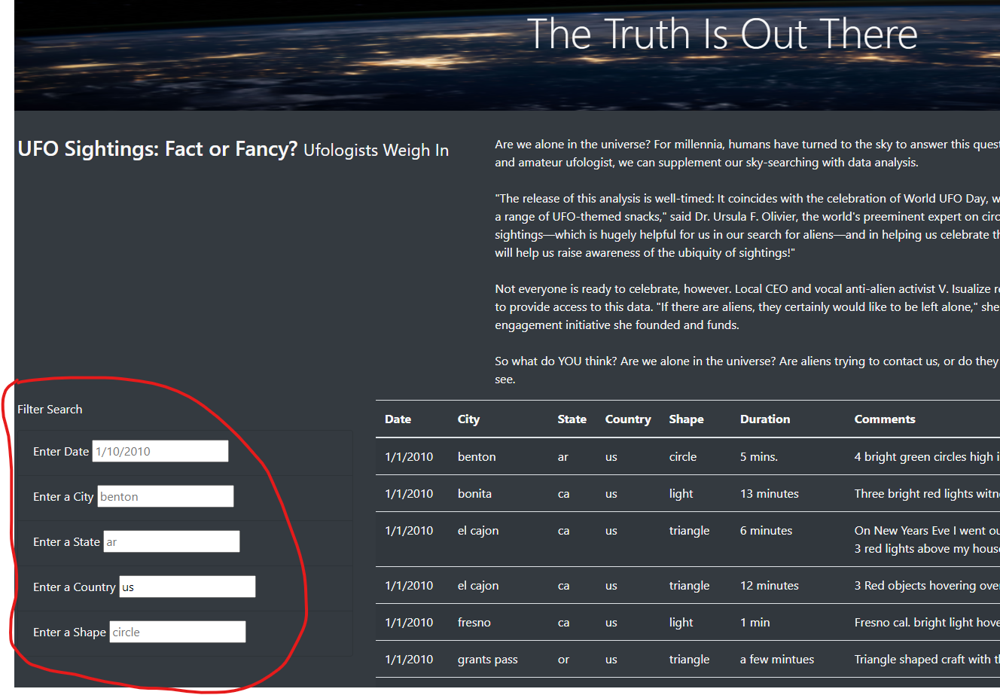
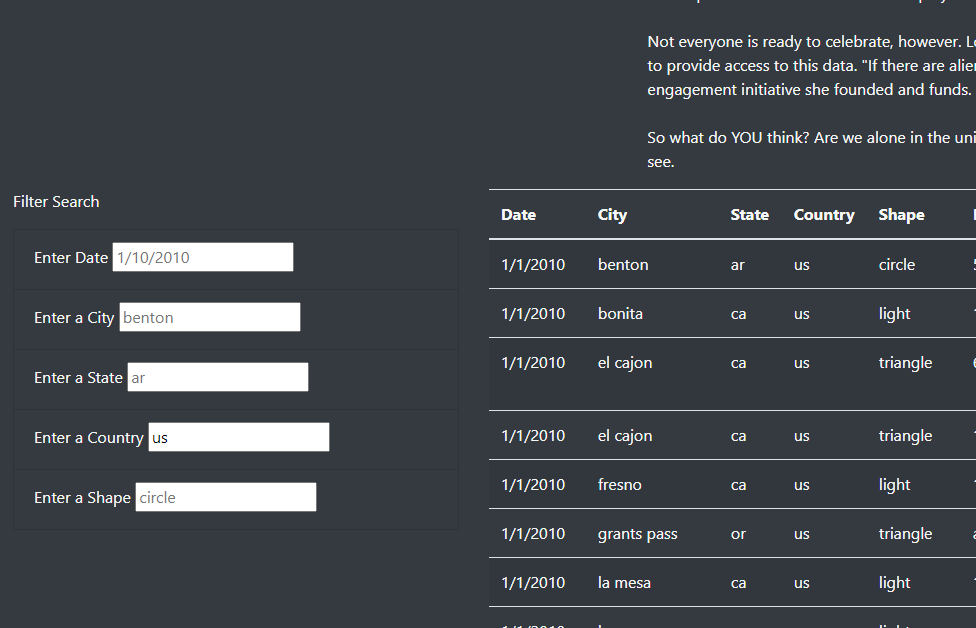
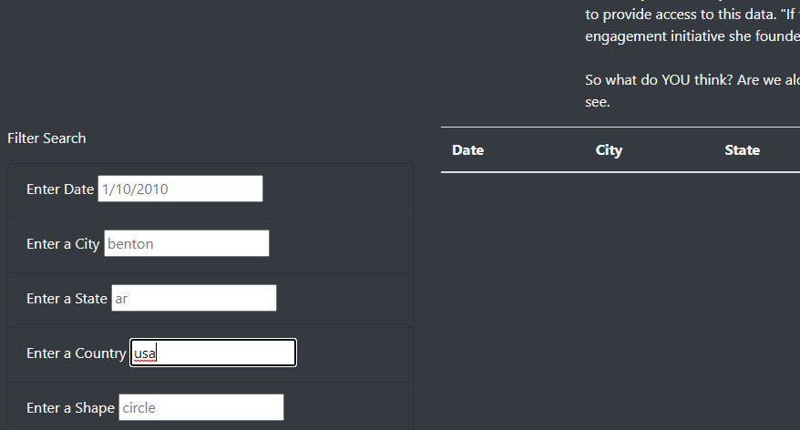

# UFO sightings in McMinnville
## Overview
Our client has requested a webpage consisting of UFO sightings data which is stored in a JavaScript array. The best way to display this data is in an interactive table, which can be filtered by the different fields at which the data was recorded: Date, City, Country, and shape of sighting

## Results
To use this site, there is a filter search section at the bottom left corner of the page:
### Figure 1 - Filter Search
</img>

If you want to search new filters for the table, you can just enter the fields and it will automatically refresh on its own. But if you want to reset the table, you can either:

1. Erase all the fields and click away/press enter(or tab)
2. Press the "UFO Sightings" link in the Navbar at the top of the page to reload the site - see Figure 2

### Figure 2 - Reset Table
</img>

## Summary

A couple drawbacks to this site is that if you type in the field in a way that doesn't match the keys in the JavaScript array, you will not get a result.
For example, under the 'Country' field, if we enter "USA" instead of "US" we will not get a result of all US sightings:

### Figure 3a - Correct entry of US
</img>
### Figure 3b - Incorrect entry of USA
</img>

Another drawback is that if you want to have more than one filter for the same key - such as wanting to see shapes of circle and triangle - the filter doesn't allow more than one.

### Recommendations

To ensure that fields are entered to match exactly as it is on the JavaScript array, we can implement a drop-down list of what fields are available. This way entries will always match our fields in our data.js array.

We can also implement a checkbox for certain fields, instead of having a form for entry/drop-down. This way they can check and uncheck multiple shapes or states. 

To remedy both drawbacks, we can also create a multi-select drop-down list. Looking into this solution briefly, results in having to use jQuery - a lightweight JavaScript library - which will allow us to create a multi-select dropdown list with checkbox.